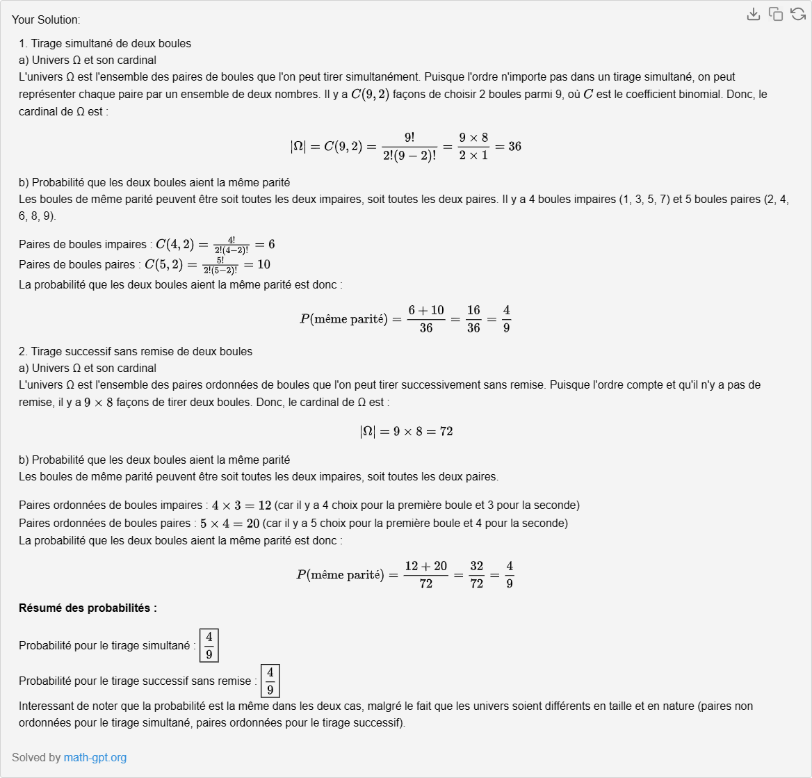

## Exercice 1: 
 Une urne qui contient neuf boules numérotées de 1 à 9.

1. On tire, dans un premier cas, deux boules simultanément.

   a) Préciser l’univers Ω associé à l’expérience, et son cardinal.

   b) Quelle est la probabilité que les deux boules aient la même parité ?

2. On tire, cette fois-ci, une boule, puis une seconde boule (sans remise de la première).

   a) Préciser l’univers Ω associé à l’expérience, et son cardinal.

   b) Quelle est la probabilité que les deux boules aient la meme parité ?

### Partie 1: Tirage simultané de deux boules

#### 1a) Univers Ω et son cardinal

Lorsque deux boules sont tirées simultanément d'une urne contenant des boules numérotées de 1 à 9, chaque élément de l'univers Ω peut être représenté par une paire de numéros, où l'ordre n'a pas d'importance (car le tirage est simultané). 

Pour calculer le cardinal de Ω, nous utilisons la combinaison car l'ordre des boules tirées n'importe pas. Le nombre de façons de choisir 2 boules parmi 9 est donné par la formule de combinaison:

$$
\binom{n}{k} = \frac{n!}{k!(n-k)!}
$$

où \( n = 9 \) et \( k = 2 \).

Calculons cela:

$$
\binom{9}{2} = \frac{9!}{2!(9-2)!} = \frac{9 \times 8}{2 \times 1} = 36
$$

Donc, l'univers Ω contient 36 éléments.

#### 1b) Probabilité que les deux boules aient la même parité

Les boules peuvent être soit toutes les deux paires, soit toutes les deux impaires. Les boules paires sont 2, 4, 6, 8 (4 boules) et les boules impaires sont 1, 3, 5, 7, 9 (5 boules).

- Nombre de façons de choisir 2 boules paires:
$$
\binom{4}{2} = \frac{4 \times 3}{2 \times 1} = 6
$$

- Nombre de façons de choisir 2 boules impaires:
$$
\binom{5}{2} = \frac{5 \times 4}{2 \times 1} = 10
$$

Le nombre total de façons de tirer deux boules de même parité est donc \( 6 + 10 = 16 \).

La probabilité que les deux boules aient la même parité est donc:
$$
P(\text{même parité}) = \frac{16}{36} = \frac{4}{9}
$$

### Partie 2: Tirage successif de deux boules sans remise

#### 2a) Univers Ω et son cardinal

Dans ce cas, l'ordre dans lequel les boules sont tirées est important car il s'agit d'un tirage sans remise. Chaque élément de l'univers Ω peut être représenté par une paire ordonnée de numéros.

Le nombre total de façons de tirer la première boule est 9, et pour chaque choix de la première boule, il reste 8 boules pour le second choix. Donc, le cardinal de Ω est:
$$
9 \times 8 = 72
$$

#### 2b) Probabilité que les deux boules aient la même parité

Nous avons déjà calculé le nombre de façons de choisir deux boules de même parité dans le cas du tirage simultané. Cependant, ici, l'ordre importe, donc chaque paire compte deux fois (une fois pour chaque ordre possible).

- Nombre de façons de choisir deux boules paires ou deux boules impaires en tenant compte de l'ordre:
$$
2 \times (6 + 10) = 32
$$

La probabilité que les deux boules aient la même parité est donc:
$$
P(\text{même parité}) = \frac{32}{72} = \frac{4}{9}
$$

Ainsi, dans les deux cas de tirage, la probabilité que les deux boules aient la même parité est 
\( \frac{4}{9} \).

