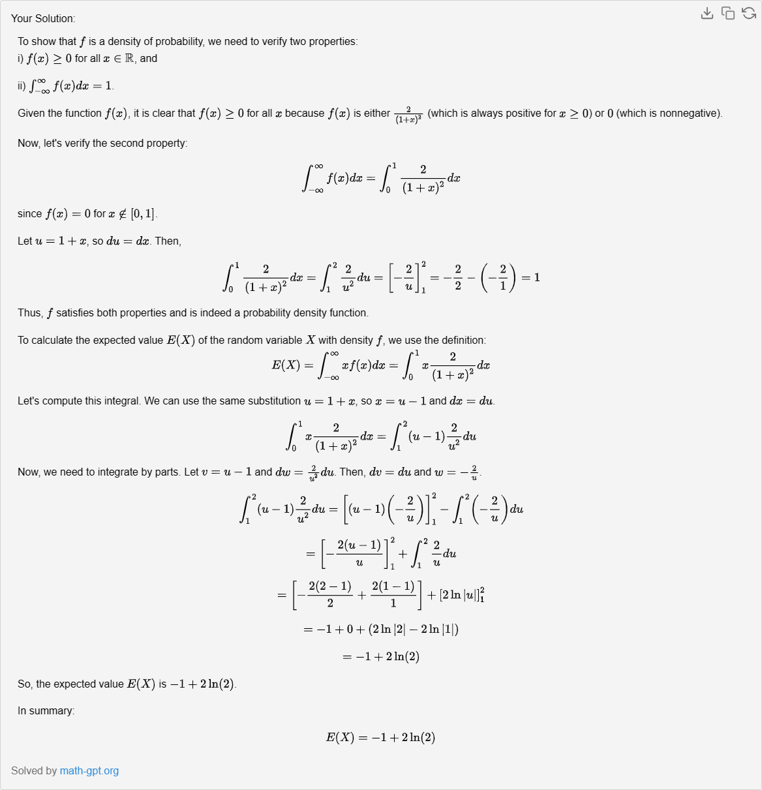

## Exercice 2 : 
Pour tout élément x de R,
f(x) = $$\frac{2}{(1+x)^2}$$ si x ∈ [0,1] et f(x) = 0 sinon.

1. Montrer que f est une densité de probabilité.

2. X est une variable aléatoire de densité f. Calculer E(X).

