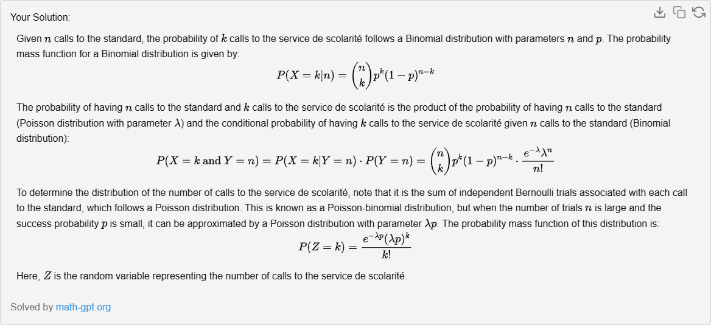

## Exercice 3 :
Le nombre d'appels téléphoniques au standard d'un établissement universitaire entre 10h et 11h suis une loi de poisson de paramètre λ. Supposons que pour chaque appel il y est une probabilité p que le correspondant demande le service de scolarité.

1. Calculez la probabilité qu'il y ait k appels pour le service de scolarité sachant qu'il y a n appels au standard.
2. Calculez la probabilité qu'il y ai n appels au standard et k appels vers le service de scolarité.
3. Déterminez la loi de probabilité du nombre d'appels vers le service de scolarité entre 10h et 11h. 

## Question 1 : 
concerne la probabilité qu'il y ait exactement \( k \) appels pour le service de scolarité, sachant qu'il y a eu \( n \) appels au standard. Cette situation est un exemple classique d'une distribution binomiale, où vous avez un nombre fixe d'essais (les \( n \) appels), et chaque essai a deux issues possibles : soit l'appel est pour le service de scolarité, soit il ne l'est pas.

La probabilité \( p \) que le correspondant demande le service de scolarité est la même pour chaque appel, et les appels sont indépendants les uns des autres. La formule de la distribution binomiale, qui donne la probabilité d'obtenir exactement \( k \) succès (dans ce cas, \( k \) appels pour le service de scolarité) sur \( n \) essais, est la suivante :

$$ P(X = k | n) = \binom{n}{k} p^k (1-p)^{n-k} $$

Le terme \( \binom{n}{k} \) est le coefficient binomial, qui représente le nombre de façons différentes de choisir \( k \) succès parmi \( n \) essais. Il est calculé comme :

$$ \binom{n}{k} = \frac{n!}{k!(n-k)!} $$

où \( n! \) est la factorielle de \( n \), qui est le produit de tous les entiers positifs jusqu'à \( n \).

En multipliant ce coefficient par \( p^k \), la probabilité que \( k \) appels soient pour le service de scolarité, et par \( (1-p)^{n-k} \), la probabilité que les \( n-k \) autres appels ne soient pas pour le service de scolarité, vous obtenez la probabilité totale d'avoir exactement \( k \) appels pour le service de scolarité parmi \( n \) appels au standard.

Pour appliquer cette formule, vous devez connaître la valeur de \( p \) et avoir un nombre spécifique d'appels \( n \) au standard. Ensuite, vous pouvez calculer la probabilité pour différentes valeurs de \( k \).

J'espère que ces informations supplémentaires vous aideront à mieux comprendre comment calculer la probabilité dans le contexte de la distribution binomiale. Si vous avez d'autres questions ou besoin d'exemples spécifiques, n'hésitez pas à demander !
## Question 2

Pour calculer la probabilité qu'il y ait **n appels au standard** et **k appels vers le service de scolarité**, nous devons considérer deux processus distincts :

1. Le nombre total d'appels au standard, qui suit une **loi de Poisson** avec le paramètre \( \lambda \).
2. Le nombre d'appels pour le service de scolarité parmi ces appels au standard, qui suit une **loi binomiale** conditionnelle à \( n \), avec la probabilité \( p \).

La probabilité d'avoir **n appels au standard** est donnée par la loi de Poisson :
$$ P(Y = n) = \frac{e^{-\lambda} \lambda^n}{n!} $$

La probabilité d'avoir **k appels pour le service de scolarité** parmi ces **n appels** est donnée par la loi binomiale :
$$ P(X = k | n) = \binom{n}{k} p^k (1-p)^{n-k} $$

Pour trouver la probabilité conjointe d'avoir **n appels au standard** et **k appels pour le service de scolarité**, nous multiplions ces deux probabilités :
$$ P(Y = n \text{ et } X = k) = P(Y = n) \cdot P(X = k | n) $$

En substituant les formules de Poisson et binomiale, nous obtenons :
$$ P(Y = n \text{ et } X = k) = \left( \frac{e^{-\lambda} \lambda^n}{n!} \right) \cdot \left( \binom{n}{k} p^k (1-p)^{n-k} \right) $$

En simplifiant, cela donne :
$$ P(Y = n \text{ et } X = k) = e^{-\lambda} \cdot \frac{\lambda^n}{k!(n-k)!} \cdot p^k \cdot (1-p)^{n-k} $$

Cette formule vous permet de calculer la probabilité que **n appels** soient reçus au standard et que parmi ceux-ci, **k appels** soient dirigés vers le service de scolarité, en utilisant les valeurs spécifiques de \( \lambda \), \( n \), \( k \), et \( p \) de votre situation.

## La question 3 :
demande de déterminer la loi de probabilité du nombre d'appels vers le service de scolarité entre 10h et 11h. Pour cela, nous allons considérer que le nombre total d'appels au standard suit une loi de Poisson et que chaque appel a une probabilité \( p \) d'être pour le service de scolarité.

La loi de Poisson est utilisée pour modéliser le nombre d'événements dans un intervalle de temps donné, sachant que ces événements se produisent avec une fréquence moyenne connue et de manière indépendante les uns des autres. La probabilité d'avoir \( k \) événements est donnée par :

$$ P(Y = k) = \frac{e^{-\lambda} \lambda^k}{k!} $$

où \( \lambda \) est le taux moyen d'événements par intervalle de temps et \( k! \) est la factorielle de \( k \).

Dans notre cas, chaque appel est indépendant et a la même probabilité \( p \) de demander le service de scolarité. Si nous avons un nombre total de \( n \) appels, la probabilité que \( k \) de ces appels soient pour le service de scolarité est donnée par la loi binomiale :

$$ P(X = k | n) = \binom{n}{k} p^k (1-p)^{n-k} $$

Cependant, puisque \( n \) est lui-même une variable aléatoire qui suit une loi de Poisson, nous devons sommer sur toutes les valeurs possibles de \( n \) pour obtenir la loi de probabilité totale du nombre d'appels vers le service de scolarité. Cela nous donne une loi de Poisson composée :

$$ P(Z = k) = \sum_{n=k}^{\infty} P(X = k | n) P(Y = n) $$

En substituant les expressions de la loi binomiale et de la loi de Poisson, nous obtenons :

$$ P(Z = k) = \sum_{n=k}^{\infty} \binom{n}{k} p^k (1-p)^{n-k} \frac{e^{-\lambda} \lambda^n}{n!} $$

Cette somme peut être simplifiée en utilisant des propriétés des séries génératrices, et on peut montrer que le résultat est une nouvelle loi de Poisson avec le paramètre \( \lambda p \) :

$$ P(Z = k) = \frac{e^{-\lambda p} (\lambda p)^k}{k!} $$

Ainsi, le nombre d'appels vers le service de scolarité entre 10h et 11h suit également une loi de Poisson, mais avec le paramètre \( \lambda \) ajusté par la probabilité \( p \) qu'un appel soit pour le service de scolarité.

Cela signifie que pour calculer la probabilité d'avoir un certain nombre d'appels vers le service de scolarité, vous pouvez utiliser la formule de la loi de Poisson avec \(\lambda p \) comme paramètre. C'est un résultat puissant car il simplifie le calcul des probabilités dans ce type de processus composé. 