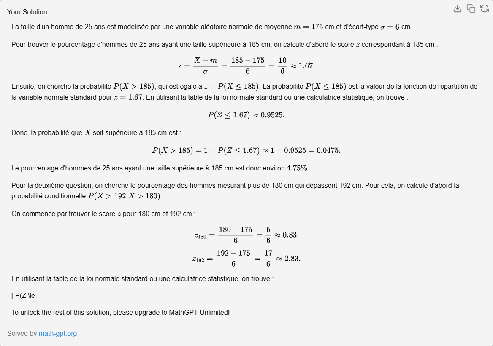

## Exercice 4 :

On suppose que la taille, en centimètres, d’un homme âgé de 25 ans est une variable aléatoire normale de paramètres m = 175 et σ = 6. Quelle est la pourcentage d’hommes de 25 ans ayant une taille supérieure à 185 cm? Parmi les hommes mesurant plus de 180 cm, quel pourcentage dépasse 192 cm ?

Pour résoudre ces questions, nous devons utiliser la fonction de distribution cumulative de la loi normale. 

1. Pourcentage d'hommes de 25 ans ayant une taille supérieure à 185 cm:

Nous devons calculer l'aire sous la courbe de la distribution normale à droite de 185 cm. Cela revient à calculer 1 moins la fonction de distribution cumulative à 185 cm.

La formule pour convertir une mesure X en un score Z dans une distribution normale est:

$$ Z = \frac{X - m}{\sigma} $$

Pour X = 185 cm, m = 175 cm et σ = 6 cm, nous obtenons:

$$ Z = \frac{185 - 175}{6} = 1.67 $$

En utilisant une table de la loi normale standard (ou une calculatrice avec la fonction de distribution cumulative), nous trouvons que la probabilité P(Z < 1.67) est d'environ 0.9525. Donc, la probabilité que la taille soit supérieure à 185 cm est de 1 - 0.9525 = 0.0475 ou **4.75%**.

2. Parmi les hommes mesurant plus de 180 cm, quel pourcentage dépasse 192 cm ?

Ici, nous devons d'abord trouver la probabilité que la taille soit supérieure à 180 cm, puis trouver la probabilité que la taille soit supérieure à 192 cm parmi ceux qui mesurent plus de 180 cm.

Pour X = 180 cm, le score Z correspondant est:

$$ Z = \frac{180 - 175}{6} = 0.83 $$

La probabilité P(Z < 0.83) est d'environ 0.7967. Donc, la probabilité que la taille soit supérieure à 180 cm est de 1 - 0.7967 = 0.2033.

Pour X = 192 cm, le score Z correspondant est:

$$ Z = \frac{192 - 175}{6} = 2.83 $$

La probabilité P(Z < 2.83) est d'environ 0.9977. Donc, la probabilité que la taille soit supérieure à 192 cm est de 1 - 0.9977 = 0.0023.

Cependant, nous voulons cette probabilité parmi ceux qui mesurent plus de 180 cm, donc nous devons diviser cette probabilité par la probabilité que la taille soit supérieure à 180 cm:

$$ \frac{0.0023}{0.2033} = 0.0113 $$

Donc, parmi les hommes mesurant plus de 180 cm, environ **1.13%** dépassent 192 cm. 

Veuillez noter que ces calculs supposent que la taille suit parfaitement une distribution normale, ce qui peut ne pas être exactement le cas dans la réalité. De plus, les valeurs exactes peuvent varier en fonction des tables de la loi normale utilisées.
