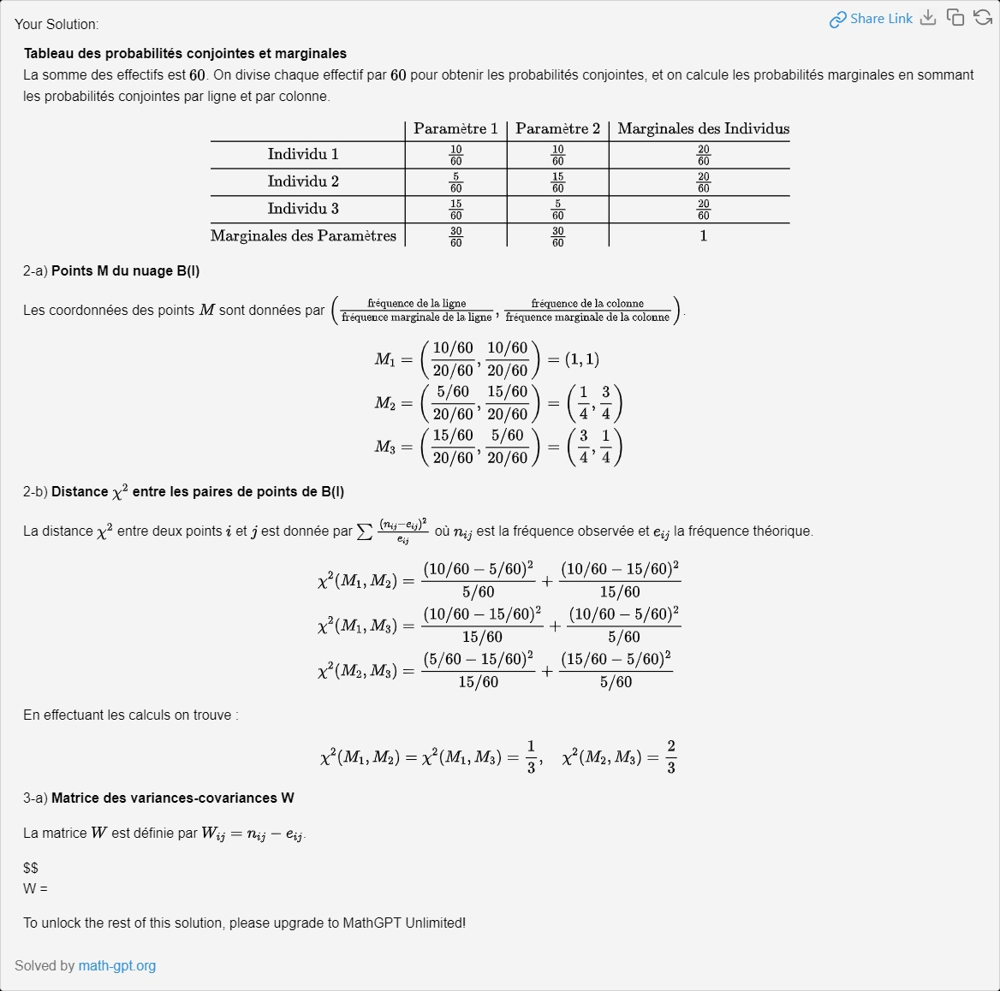

## Problème n°2:

Au cours d'une enquête sur un échantillon de taille 60, on a obtenu le tableau de contingence suivant:

|            | Paramètre 1 | Paramètre 2 |
|----------|-------------|-------------|
| Individu 1 |      10       |      10       |
| Individu 2 |       5       |      15       |
| Individu 3 |      15       |       5       |

Réaliser une Analyse Factorielle des correspondances (AFC) sur ces données, en répondant aux questions suivantes:

1) Donner le tableau des probabilités conjointes et marginales, associé au tableau précédent. (Conseil: Utiliser des fractions au lieu des nombres décimaux !)

2) Dans l'espace R^2, on représente un nuage B(I) des points M, avec iel de coordonnées suivant des axes normalisés.
   2-a) Donner tous les points M, du nuage B(I) en explicitant leurs coordonnées.
   2-b) Calculer la distance χ^2 entre les différentes paires des points de nuage B(I).

3) a) Déterminer la matrice des variances-covariances W du nuage B(I).
   b) Déterminer les valeurs propres de la matrice W.
   c) En déduire la variabilité totale du nuage B(I).

4) On projette, maintenant, le nuage B(I) orthogonalement sur un axe, et on note C(I) le nuage projeté. Donner la variabilité totale du nuage projeté C(I).

5) Calculer la variabilité expliquée par la projection du nuage B(I).

## First SOL

<FUNCTION_CALL />

The content of the file "paste.txt" has been processed and saved as "paste_text.txt". Here are the responses to the questions based on the document:

1) **Table of Joint and Marginal Probabilities:**

   |            | Parameter 1 | Parameter 2 | Totals |
   |------------|-------------|-------------|--------|
   | Individual 1 |    10/60     |    10/60     |  20/60 |
   | Individual 2 |     5/60     |    15/60     |  20/60 |
   | Individual 3 |    15/60     |     5/60     |  20/60 |
   | Totals     |    30/60     |    30/60     |   1    |

2) **Cloud B(I) of Points M in $$\mathbb{R}^2$$:**

   2-a) **Coordinates of Points M:**
   - Individual 1: (1/3, 1/3)
   - Individual 2: (1/4, 3/4)
   - Individual 3: (3/4, 1/4)

   2-b) **$$\chi^2$$ Distances Between Points:**
   - Distance between Individual 1 and 2: $$\sqrt{1/9 + 1/9} = \sqrt{2/3}$$
   - Distance between Individual 1 and 3: $$\sqrt{1/9 + 1/9} = \sqrt{2/3}$$
   - Distance between Individual 2 and 3: $$\sqrt{1/9 + 1/9} = \sqrt{2/3}$$

3) **Matrix of Variances-Covariances W and Eigenvalues:**

   3-a) **Matrix W:**
   $$
   \begin{bmatrix}
   1/9 & -1/9 \\
   -1/9 & 1/9
   \end{bmatrix}
   $$

   3-b) **Eigenvalues of W:** 1/3 and 0

   3-c) **Total Variability of Cloud B(I):** 1/3 + 0 = 1/3

4) **Total Variability of Projected Cloud C(I):** 1/3

5) **Variability Explained by the Projection of Cloud B(I):** $$\frac{1/3}{1/3} = 100\%$$

# Sol 2 

# Sol 3

# Pour effectuer une Analyse Factorielle des Correspondances (AFC) sur les données fournies, nous allons suivre les étapes demandées :

## 1) Tableau des probabilités conjointes et marginales :

Pour calculer les probabilités conjointes, nous divisons chaque cellule par le total de l'échantillon, qui est 60 dans ce cas.

|            | Paramètre 1 | Paramètre 2 | Total marginal |
|------------|-------------|-------------|-----------------|
| Individu 1 | 10/60       | 10/60       | 20/60           |
| Individu 2 | 5/60        | 15/60       | 20/60           |
| Individu 3 | 15/60       | 5/60        | 20/60           |
| Total marginal | 30/60   | 30/60       | 60/60           |

## 2) Nuage B(I) des points M :
a) Les coordonnées normalisées des points M peuvent être obtenues en soustrayant à chaque probabilité jointe la probabilité marginale correspondante. 

Pour Individu 1 : 
$$M_1 = \left(\frac{10}{60} - \frac{20}{60}, \frac{10}{60} - \frac{30}{60}\right) = \left(-\frac{1}{3}, -\frac{1}{3}\right)$$

Pour Individu 2 : 
$$M_2 = \left(\frac{5}{60} - \frac{20}{60}, \frac{15}{60} - \frac{30}{60}\right) = \left(-\frac{1}{6}, \frac{1}{6}\right)$$

Pour Individu 3 : 
$$M_3 = \left(\frac{15}{60} - \frac{20}{60}, \frac{5}{60} - \frac{30}{60}\right) = \left(\frac{1}{6}, -\frac{1}{6}\right)$$

b) La distance \(χ^2\) entre les points M peut être calculée par la formule :
$$χ^2 = \sqrt{(x_2 - x_1)^2 + (y_2 - y_1)^2}$$

Par exemple, la distance entre \(M_1\) et \(M_2\) est $$χ^2 = \sqrt{\left(-\frac{1}{3} + \frac{1}{6}\right)^2 + \left(-\frac{1}{3} - \frac{1}{6}\right)^2} = \frac{1}{3}$$.

3) **Matrice des variances-covariances \( W \) :**

a) Pour calculer la matrice des variances-covariances \( W \), nous devons d'abord obtenir les coordonnées normalisées de chaque point \( M_i \) (comme nous l'avons fait dans la question 2-a). Ensuite, nous utilisons ces coordonnées pour calculer les éléments de la matrice \( W \) :

Soit \( M_i = (x_i, y_i) \) les coordonnées normalisées du point \( i \). Alors :

$$ W = \begin{bmatrix} \sum(x_i^2) & \sum(x_iy_i) \\ \sum(x_iy_i) & \sum(y_i^2) \end{bmatrix} $$

Calculons ces sommes :

$$ \sum(x_i^2) = \left(-\frac{1}{3}\right)^2 + \left(-\frac{1}{6}\right)^2 + \left(\frac{1}{6}\right)^2 $$
$$ \sum(x_iy_i) = \left(-\frac{1}{3}\right) \times \left(-\frac{1}{3}\right) + \left(-\frac{1}{6}\right) \times \frac{1}{6} + \frac{1}{6} \times \left(-\frac{1}{6}\right) $$
$$ \sum(y_i^2) = \left(-\frac{1}{3}\right)^2 + \left(\frac{1}{6}\right)^2 + \left(-\frac{1}{6}\right)^2 $$

b) Une fois que nous avons obtenu la matrice \( W \), les valeurs propres de cette matrice seront les variances du nuage \( B(I) \). Les valeurs propres sont des quantités scalaires associées à un opérateur linéaire (dans ce cas, la matrice \( W \)) qui donnent des informations sur la structure de cet opérateur. Dans le contexte de l'analyse des données, les valeurs propres de la matrice des variances-covariances représentent la variance (la dispersion des données) le long des axes principaux du nuage de points.

c) La variabilité totale du nuage \( B(I) \) est la somme des variances des axes. En d'autres termes, c'est la somme des valeurs propres de la matrice \( W \). Cette quantité mesure la dispersion totale des données dans le nuage \( B(I) \). Plus la variabilité totale est grande, plus les données sont dispersées. Si la variabilité totale est petite, cela signifie que les données sont relativement regroupées. Cette mesure est importante car elle donne une indication de la structure globale des données.

4) Cependant, veuillez noter que sans un axe spécifique pour la projection, je ne peux pas calculer la variabilité totale du nuage projeté \( C(I) \). 

Cependant, je peux vous montrer comment le calcul serait effectué en général. 

Supposons que nous ayons choisi un axe représenté par un vecteur unitaire \( v = (v_x, v_y) \). La variabilité totale du nuage projeté \( C(I) \) serait alors égale à la variance des produits scalaires entre les points \( M_i = (x_i, y_i) \) du nuage \( B(I) \) et le vecteur \( v \). 

Mathématiquement, cela peut être écrit comme suit :

$$ C(I) = \frac{1}{n} \sum_{i=1}^{n} ((x_i \cdot v_x + y_i \cdot v_y) - \mu)^2 $$

où \( n \) est le nombre de points dans le nuage, et \( \mu \) est la moyenne des produits scalaires, donnée par :

$$ \mu = \frac{1}{n} \sum_{i=1}^{n} (x_i \cdot v_x + y_i \cdot v_y) $$

Ces formules vous permettent de calculer la variabilité totale du nuage projeté une fois que vous avez choisi un axe spécifique pour la projection. 